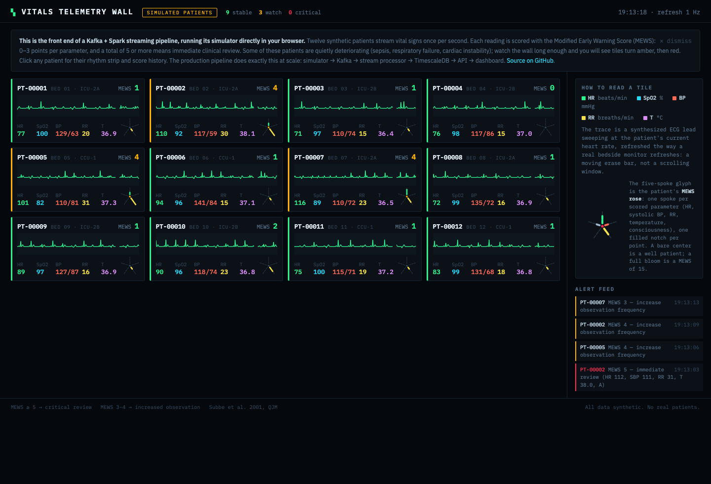
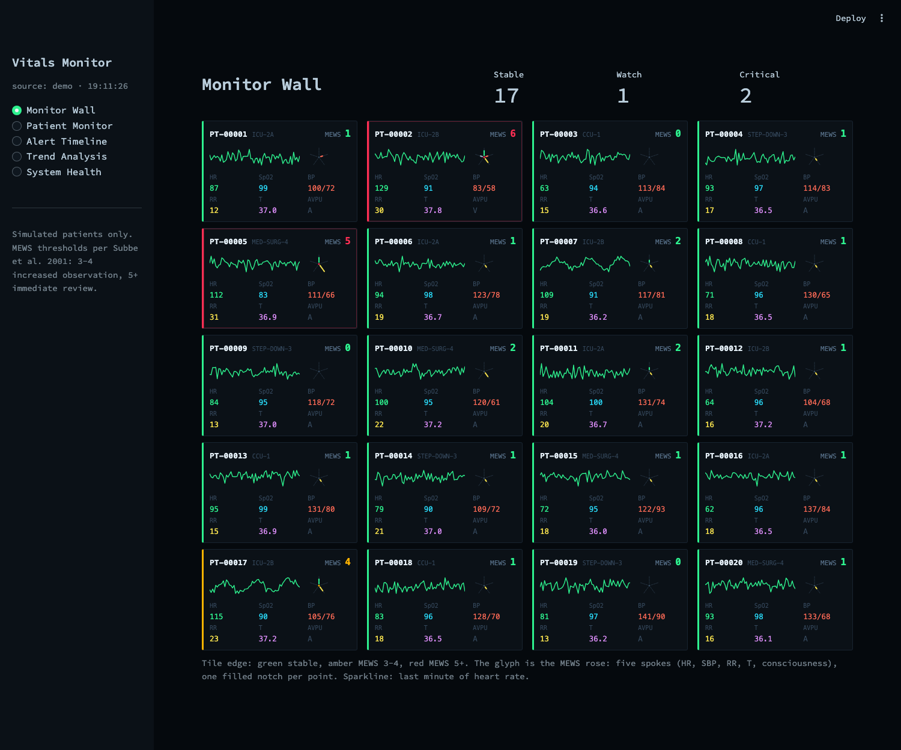

# Real-Time Patient Vitals Streaming Platform

A streaming pipeline that ingests continuous patient vital signs, scores every
reading for clinical deterioration in real time, and surfaces the results the
way a hospital actually would: as a central monitoring station.

Kafka carries the readings, a stream processor computes the Modified Early
Warning Score (MEWS) and runs statistical anomaly detection on every reading,
TimescaleDB stores the time series, and a FastAPI + Streamlit layer serves it
all live.

**[Open the live demo](https://kenny0bi.github.io/real-time-vitals-pipeline/)**,
no install needed. It runs the pipeline's simulator directly in your browser:
twelve synthetic patients, one reading per second, a few of them quietly
deteriorating. Watch tiles turn amber, then red. Click a patient for their
MEWS rhythm strip.



## Why it looks like this

Most data projects pour their output into default charts. This data is
continuous bedside telemetry, so the interface is built out of that shape
instead:

- Every patient tile carries a **synthesized ECG trace** that sweeps at the
  patient's current heart rate, refreshed the way a real monitor refreshes
  (a moving erase bar, not a scrolling window). Channel colors follow real
  monitor conventions: green HR, cyan SpO2, red/amber BP, yellow RR, violet
  temperature.
- MEWS over time is drawn as a **rhythm strip**, a stepped trace crossing
  amber and red alarm bands, because a score that triggers clinical action
  deserves the same visual treatment as the vitals themselves.
- Each patient gets a **MEWS rose**: a five-spoke glyph, one spoke per scored
  parameter, one filled notch per point. A bare center is a well patient; a
  full bloom is a MEWS of 15. You can read a whole ward's state from the
  glyphs alone. (The hand-coded-legend idea owes a debt to Lupi and Posavec's
  Dear Data project.)

The Streamlit dashboard uses the same design system:



## Architecture

```
                     ┌──────────────────────────────────────────┐
                     │            docker compose                │
┌────────────┐   ┌───┴───┐   ┌──────────────────────┐   ┌───────┴──────┐
│ Vitals     │──▶│ Kafka │──▶│ Stream processing     │──▶│ TimescaleDB  │
│ simulator  │   │ 3     │   │ MEWS + anomaly + alert│   │ hypertables  │
│ 20 patients│   │ topics│   │ (Spark or pure Python)│   │ + cont. aggs │
└────────────┘   └───┬───┘   └──────────┬───────────┘   └───────┬──────┘
                     │                  │ scored readings        │
                     │                  ▼                        ▼
                     │            ┌──────────┐          ┌───────────────┐
                     │            │  Redis   │          │ FastAPI       │
                     │            │ pub/sub  │─────────▶│ REST + WS     │
                     │            └──────────┘          └───────┬───────┘
                     │                                          ▼
                     │                                  ┌───────────────┐
                     └─────────────────────────────────▶│ Streamlit     │
                                                        │ dashboard     │
                                                        └───────────────┘
```

There are two processing paths, on purpose:

- `src/processing/stream_processor.py` is the Spark Structured Streaming job:
  windowed aggregations, MEWS as column expressions, foreachBatch sink into
  TimescaleDB. This is the horizontal-scale path.
- `src/processing/stream_worker.py` is a pure-Python consumer that does the
  same job on one node with no JVM: MEWS scoring, stateful per-patient anomaly
  detection, alert latching, TimescaleDB writes, and Redis publishing for the
  WebSocket feed. Spark is genuinely awkward for stateful per-patient logic,
  and most single-machine deployments do not need it. The processing core
  (`VitalsProcessor`) is transport-free, which is what makes it testable
  without any infrastructure running.

## Clinical scoring: MEWS

Each vital sign parameter scores 0 to 3 points (Subbe et al. 2001, QJM):

| Parameter | 3 | 2 | 1 | 0 | 1 | 2 | 3 |
|---|---|---|---|---|---|---|---|
| **Systolic BP** | ≤70 | 71–80 | 81–100 | 101–199 | | ≥200 | |
| **Heart rate** | | ≤40 | 41–50 | 51–100 | 101–110 | 111–129 | ≥130 |
| **Respiratory rate** | | <9 | | 9–14 | 15–20 | 21–29 | ≥30 |
| **Temperature (°C)** | | <35.0 | | 35.0–38.4 | | ≥38.5 | |
| **AVPU** | | | | Alert | Voice | Pain | Unresponsive |

A total of 3 to 4 means increased observation. **5 or more means immediate
clinical review**, and that is the pipeline's alert threshold. Missing
parameters score 0, a documented assumption to avoid false alarms on partial
readings.

Two things I learned building the alerting on top of this:

- A patient parked at MEWS 6 must not fire an alert on every reading. Alerts
  latch per patient: fire on the crossing, suppress repeats, re-arm after 20
  consecutive readings below threshold.
- The same applies to trend detection. Five consecutive rises fire once, then
  the direction buffer resets; a 40-reading climb is one event, not 35
  duplicate alerts. Before this fix the demo ward generated an alert for
  roughly one reading in eighteen, which is a feed nobody would read.

## Anomaly detection

`VitalsAnomalyDetector` keeps independent rolling statistics per patient
(what is normal for one patient does not set the threshold for another):

- **Shewhart rule**: flag readings more than 3 sigma from the patient's own
  rolling mean (30-reading window, after a 10-reading baseline)
- **Trend rule**: flag 5 or more consecutive monotonic moves in one direction
- Both feed warning-severity alerts alongside the MEWS threshold alerts

## Running it

### Zero-install demo

Open [the hosted demo](https://kenny0bi.github.io/real-time-vitals-pipeline/)
or just `open docs/index.html`. The simulator, MEWS calculator, and alert
logic are ported to JavaScript so the whole thing runs client-side.

### Dashboard without Docker

```bash
pip install -r requirements-demo.txt
make demo          # streamlit with the real pipeline core running in-process
```

Demo mode is not a mock: the actual `VitalsSimulator`, `calculate_mews`,
`VitalsAnomalyDetector`, and alert latching from `src/` run inside the
Streamlit process. The dashboard also auto-falls-back to this mode with a
banner when TimescaleDB is unreachable.

### Full pipeline

```bash
pip install -r requirements.txt
cp .env.example .env
make up            # Kafka, TimescaleDB (schema auto-applied), Redis, Kafka UI
make simulator     # 20 patients at 1 Hz -> vitals.raw
make worker        # pure-Python processor (or: make stream, for Spark)
make api           # FastAPI on :8000 (docs at /docs)
make dashboard     # Streamlit on :8501, now in live mode
```

### API

| Method | Endpoint | Description |
|---|---|---|
| `GET` | `/api/v1/patients` | All patients, latest vitals + MEWS, filter by unit/status |
| `GET` | `/api/v1/patients/{id}/vitals` | History from raw hypertable or 5min/1hr continuous aggregates |
| `GET` | `/api/v1/patients/{id}/mews` | MEWS history with per-parameter breakdown |
| `GET` | `/api/v1/patients/{id}/alerts` | Alert history with severity/ack filters |
| `GET` | `/api/v1/alerts` | Ward-wide alert feed |
| `GET` | `/api/v1/units/{unit}/overview` | Bed-map data with status counts |
| `GET` | `/api/v1/analytics/trends` | Ward trends from continuous aggregates |
| `GET` | `/api/v1/pipeline/status` | Data freshness, throughput, DB size |
| `WS` | `/api/v1/ws/vitals/{id}` | Live per-patient stream via Redis pub/sub |

The API starts cleanly with the infrastructure down; data endpoints return a
503 with instructions instead of a stack trace.

### Analytics layer

dbt models over the pipeline's output (staging → intermediate → marts):
patient monitoring sessions (a 30-minute gap starts a new session), hourly
rollups, per-patient summaries, unit-level census and alert rates, and alert
analytics including time-to-acknowledge. Schema tests cover keys, accepted
values, and uniqueness. `dbt/profiles.yml.example` has the connection.

Data quality gates live in `src/quality/vitals_expectations.py`: a
dependency-free validator (plausible physiological ranges, required fields,
AVPU domain) plus a builder for the equivalent Great Expectations suite. The
ranges mark impossible values, not abnormal ones; a heart rate of 180 is a
sick patient, a heart rate of 400 is a broken sensor.

## Testing

```bash
make test    # 101 unit tests, no infrastructure needed
make lint    # ruff, clean
```

Unit tests cover every MEWS scoring boundary, the deterioration trajectories
(sepsis raises HR/RR/temperature and drops BP, and the tests prove it),
Shewhart and trend detection including the once-per-run re-arm behavior,
alert latching per patient, the data quality gates at their exact boundaries,
and the API's degraded-mode behavior. Integration tests
(`tests/integration/`) spin up real Kafka and TimescaleDB via testcontainers
and are skipped automatically when Docker is absent.

CI runs lint plus the unit suite on Python 3.11 and 3.12.

## Project structure

```
├── docs/index.html               # the browser demo (GitHub Pages)
├── docker-compose.yml            # Kafka, TimescaleDB, Redis, Kafka UI
├── sql/001_timescale_schema.sql  # hypertables, continuous aggregates, retention
├── src/
│   ├── config/settings.py        # pydantic-settings, .env-driven
│   ├── ingestion/                # simulator + Kafka producer
│   ├── processing/               # MEWS, anomaly detection, Spark job, worker
│   ├── storage/                  # TimescaleDB writer (COPY / execute_values)
│   ├── api/                      # FastAPI + asyncpg + Redis WebSocket
│   ├── dashboard/                # Streamlit app, theme, demo/live data layer
│   └── quality/                  # data quality gates + GE suite builder
├── dbt/                          # staging / intermediate / marts + tests
└── tests/                        # unit (101) + integration (testcontainers)
```

## Honest notes

- All patients are synthetic. The simulator models three deterioration
  patterns (sepsis, respiratory failure, cardiac instability) as gradual
  parameter drifts with Gaussian noise, and consciousness only degrades late
  in an arc. No real patient data anywhere.
- MEWS thresholds are implemented exactly as published, but this is a
  portfolio system, not a medical device.
- The browser demo is a faithful JS port of the Python scoring and simulation
  logic, kept in sync by hand. The Python side is the source of truth and the
  one under test.
